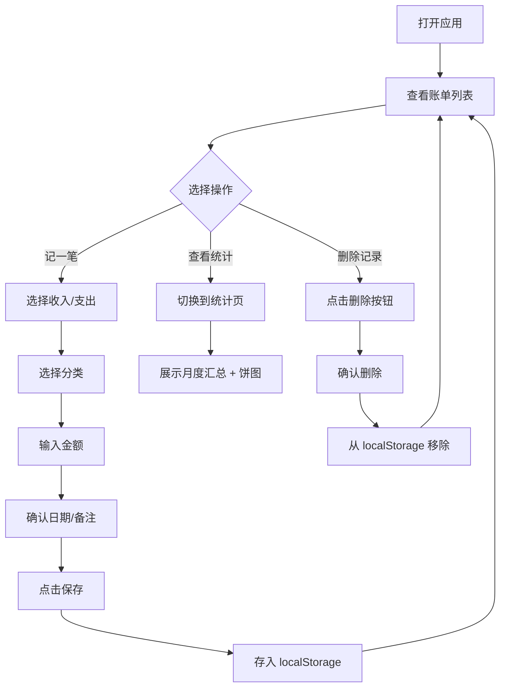

## 1. 产品概述

极简记账本是一款手机端单页应用，帮助用户快速记录日常收支，提供月度统计与分类占比分析。无需后端，数据完全存储在浏览器本地。

- 目标用户：需要简单记账的普通个人用户
- 核心价值：随时随地快速记账，数据本地存储保护隐私

## 2. 核心功能

### 2.1 用户角色

无需注册登录，打开即用，单人使用模式。

### 2.2 功能模块

1. **记账录入页**：金额输入、收支类型切换、分类选择、日期选择、备注填写
2. **账单列表页**：按时间倒序展示全部账单记录，支持删除单条
3. **月度统计页**：本月总收入/总支出/结余金额，饼图展示各类别占比

### 2.3 页面详情

| 页面名称 | 模块名称 | 功能描述 |
|---------|---------|---------|
| 记账录入 | 类型切换 | 收入/支出大按钮切换，选中态高亮 |
| 记账录入 | 分类选择 | 九宫格方式展示7个分类（餐饮、交通、购物、工资、房租、娱乐、其他），点击选中 |
| 记账录入 | 金额输入 | 大号数字键盘输入，支持小数点 |
| 记账录入 | 日期选择 | 默认当天，可修改，使用原生日期选择器 |
| 记账录入 | 备注输入 | 可选备注文本框 |
| 记账录入 | 保存按钮 | 醒目的保存按钮，保存后清空表单并刷新列表 |
| 账单列表 | 记录展示 | 按日期分组，每条显示分类图标、金额、备注、类型标记 |
| 账单列表 | 删除操作 | 每条记录右侧删除按钮，点击确认后删除 |
| 月度统计 | 汇总卡片 | 三张卡片：本月收入(绿)、本月支出(红)、结余(蓝) |
| 月度统计 | 饼图 | Canvas 绘制饼图，显示各类别金额与占比 |

## 3. 核心流程

## 4. 用户界面设计

### 4.1 设计风格

- **主色调**：清新薄荷绿 `#10B981` 为主色，搭配柔和暖色点缀
- **背景色**：浅灰白 `#F9FAFB`，卡片纯白 `#FFFFFF`
- **按钮风格**：大圆角（16px）、柔和阴影、点击有缩放反馈
- **字体**：系统默认中文字体，数字使用等宽字体
- **布局**：底部 Tab 导航切换三个页面（记账、账单、统计）
- **图标**：使用 Emoji 表示分类，直观友好

### 4.2 页面设计概览

| 页面名称 | 模块名称 | UI 元素 |
|---------|---------|--------|
| 记账页 | 类型切换 | 两个大按钮并排，收入绿色/支出橙色，选中加深 |
| 记账页 | 分类选择 | 3×3 网格（最后一行2个），每个带 Emoji 和文字 |
| 记账页 | 金额输入 | 顶部大号数字显示区，输入数字即时显示 |
| 记账页 | 日期备注 | 紧凑行内布局，日期左、备注右 |
| 记账页 | 保存 | 底部固定大按钮，主题色填充 |
| 账单页 | 记录列表 | 卡片式列表，左侧分类Emoji，中间描述，右侧金额+删除 |
| 统计页 | 汇总卡片 | 顶部三张并排小卡片 |
| 统计页 | 饼图 | Canvas 绘制的环形饼图，中间显示总金额 |
| 全局 | 底部导航 | 三个 Tab 图标+文字，固定底部 |

### 4.3 响应式设计

- 移动端优先，最大宽度 480px 居中显示
- 大屏设备上显示手机模拟框效果
- 触摸友好：按钮最小 44px，间距充足