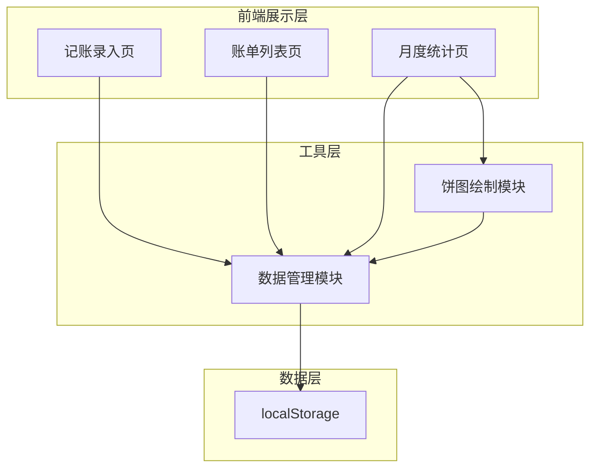

## 1. 架构设计



## 2. 技术选型

* **前端**：原生 HTML + Tailwind CSS (CDN) + 原生 JavaScript

* **数据存储**：浏览器 localStorage

* **图表**：原生 Canvas API 绘制饼图

* **运行方式**：单个 HTML 文件，直接在浏览器打开即可运行

无任何构建工具、无框架依赖、无后端服务。

## 3. 页面结构

| 页面   | 说明              |
| ---- | --------------- |
| 记账录入 | 默认首页，底部 Tab 第一个 |
| 账单列表 | 底部 Tab 第二个      |
| 月度统计 | 底部 Tab 第三个      |

三个页面通过底部 Tab 导航切换，实际为同一 HTML 页面内的三个 `<section>` 通过显示/隐藏切换。

## 4. 数据模型

### 4.1 数据结构

```javascript
// 账单单条记录
{
  id: string,          // 唯一标识 (时间戳)
  type: 'income' | 'expense',  // 收入/支出
  category: string,    // 分类名称
  amount: number,      // 金额
  date: string,        // 日期 YYYY-MM-DD
  note: string,        // 备注
  createdAt: number    // 创建时间戳
}

// localStorage 存储结构
// key: 'bills'
// value: JSON.stringify(billArray)
```

### 4.2 分类定义

```javascript
const CATEGORIES = {
  income: [
    { name: '工资', emoji: '💰', color: '#10B981' },
    { name: '其他', emoji: '📦', color: '#6B7280' }
  ],
  expense: [
    { name: '餐饮', emoji: '🍜', color: '#F59E0B' },
    { name: '交通', emoji: '🚗', color: '#3B82F6' },
    { name: '购物', emoji: '🛒', color: '#EC4899' },
    { name: '房租', emoji: '🏠', color: '#8B5CF6' },
    { name: '娱乐', emoji: '🎮', color: '#6366F1' },
    { name: '其他', emoji: '📦', color: '#6B7280' }
  ]
};
```

## 5. 核心函数

| 函数                           | 用途                    |
| ---------------------------- | --------------------- |
| `getBills()`                 | 从 localStorage 读取账单数组 |
| `saveBill(bill)`             | 添加一条账单到 localStorage  |
| `deleteBill(id)`             | 根据 id 删除账单            |
| `getMonthBills(year, month)` | 获取指定月份账单              |
| `renderBillList()`           | 渲染账单列表                |
| `renderStats()`              | 渲染统计页汇总和饼图            |
| `drawPieChart(data)`         | Canvas 绘制饼图           |
| `switchTab(tab)`             | 切换底部 Tab 页面           |

